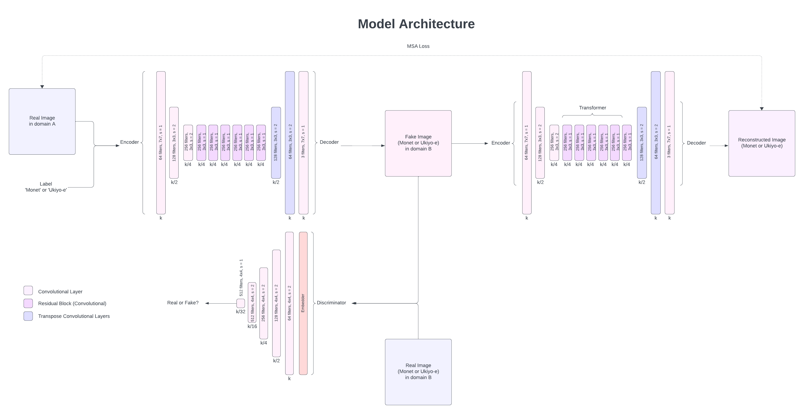

**Group 56:** \\
Arya Mohan\\
Maitreyee Talnikar\\
Rajvi Parekh\\
Varun Komperla

# Introduction 

Neural Style Transfer (NST) is a technique in artificial intelligence and computer vision that involves applying the visual style of one image (such as a painting or artwork) to another image, typically a photograph. Let's say that a photographer is a fan of Monet artwork. Then, using NST, they could generate images of their photographs with the style of a Monet painting. Apart from art, NST has some other applications such as:

- NST applications could enhance digital marketing and branding by enabling easy and automated generation of ad campaigns, logos, and branding elements, enhancing the efficiency and creativity of designers.

- Given the widespread growth of AR/VR today, there is room for use of NST in applications like flight simulators where different weather conditions may need to be emulated.

- NST can serve as a tool for generative artists to create novel and diverse visual content by combining various styles and content sources.

The foundational NST algorithm was introduced in 2015 [[1](#references)] which used VGG-19. There has been huge improvement in NST algorithms since then. Algorithms that enable the learning of multiple styles have been developed. These models take the desired style as input, and generate an output of the image in the selected style.

An example of Neural Style Transfer, taken from [1], is shown below:

|  | 
|:--:| 
| *Example of Neural Style Transfer [1]* |

The image on the left is the orginal image, the smaller image on the right is the artistic style, and the larger image on the right is the output generated using the NST algorithm.

## Objectives

Our project has 3 objectives:
1. Implement NST using a Cycle GAN. This model will be trained on one artistic style, and will generate images in that style.
2. Improve this model by performing NST using an Auxillary Classifier Cycle GAN to be able to learn multiple styles and generate the output image given the desired style as an additional input. 
3. Attempt to use the GAN in the previous step to generate an output image with a blend/mixture of the learned styles.

# Related Works

The following papers were explored to gain an understanding of the field of Neural Style Transfer for this project.

- **Gatys, Leon A., Alexander S. Ecker, and Matthias Bethge. _"A neural algorithm of artistic style."_ (2015)**: Introduced the foundational optimization-based approach for style transfer using VGG-19 feature loss. This method takes as input, a content image (ex: photogtaph) and a style image (ex: painting). It then aims to generate an image (starting from a white noise image) that mixes the content from the photograph with the style of the painting by jointly minimizing the distance between the white noise image and the content and style images. 

- **Johnson, Justin, Alexandre Alahi, and Li Fei-Fei. _"Perceptual losses for real-time style transfer and super-resolution."_ (2016)**: Explores the use of perceptual loss instead of per-pixel loss for training image transformation networks. This paper explores two specific applications using perceptual loss: Style Transfer and Super Resolution. The authors use a _"loss network"_ (which is a pre-trained CNN itself) to calculate the loss between the output and the content and style images. This loss is called  "perceptual" loss since it takes advantage of a pre-trained CNN which has learned to extract the perceptual information of an image. In the style transfer experiments, the loss network is used to calculate 2 loss functions: Feature Reconstruction Loss which measures the difference from the content image and Style Reconstruction Loss which measures the difference from the style image.  Results show that this approach is able to generate outputs 3x faster.

- **Chen, Dongdong, et al. _"Stylebank: An explicit representation for neural image style transfer."_ (2017)**: Leverages multiple sets of style-specific filters, called _"Style Banks"_ to separately and efficiently apply different artistic styles to images through a single auto-encoder, streamlining the style transfer process. The network consists of an encoder, followed by \\(K\\) Style banks, and finally a decoder. The auto-encoder and StyleBank layers are trained together. The style index is specified during training and the corresponding filter bank \\(K_i\\) is used. This approach allows for incremental training, since once the network is trained, a new style can be added by fixing the auto-encoder and just training the new style bank. This modular architecture also enabled generation of images using a fusion of styles by linearly combining the corresponding style banks.

- **Huang, Xun, and Serge Belongie. _"Arbitrary style transfer in real-time with adaptive instance normalization."_ (2017)**: Presented adaptive instance normalization (AdaIN) technique to align feature statistics between content and style image. The authors propose an extension to the Instance Normalization layer called Adaptive Instance Normalization (AdaIN) which aligns the channel-wise mean and variance of the content image to match the style image. The authors use a simple auto-encoder architecture with the AdaIN layer between the encoder and the decoder. 

- **Zhu, Jun-Yan, Taesung Park, Phillip Isola, and Alexei A. Efros. _"Unpaired Image-to-Image Translation using Cycle-Consistent Adversarial Networks."_ (2017)**: This paper introduces a method for translating images from one domain to another without the need for paired examples. The authors develop a framework that utilizes two mapping functions, along with a cycle consistency loss to ensure that an image translated from one domain to the other and back again will closely resemble the original image. This is critical because it helps the model learn a meaningful transformation without the need for one-to-one mapping between source and target domain images. The paper demonstrates qualitative and quantitative results across a range of tasks where paired training data does not exist, such as style transfer, object transfiguration, season transfer, and photo enhancement.

- **Odena, Olah &amp; Shlens. _"Conditional Image Synthesis with Auxiliary Classifier GANs."_ (2017)**:  The authors propose the _auxillary classifier GAN_ (AC-GAN). This is a modified variant of the GAN architecture. In this model, the generator takes the class label as input in addition to the noise. The discriminator predicts the source as well as the class label. This is different from the _conditional GAN_, wherein the discriminator takes the class label as input. The key idea is that it is known that having the model perform additional tasks can improve the model's performance on the orginal task. Thus, having the discriminator predict the class label of the generated can help improve the quality of the generated image.

Our project builds upon a foundation of existing research in Neural Style Transfer (NST) and image translation, which primarily focused on transferring the style of a single artistic reference onto a content image. However, a gap in prior work lies in the limited exploration of combining multiple artistic styles within a single model and enabling conditional art generation based on the chosen style.

1. **Integration of Multiple Artistic Styles**: While previous methods excel at transferring the style of a single reference image onto the content, they lack the ability to seamlessly blend or switch between multiple styles. Our project introduces an Auxiliary Classifier Cycle GAN (AC-CycleGAN) approach, enabling the model to learn and integrate multiple artistic styles into the style transfer process. This expands the creative possibilities for generating diverse and hybrid artistic outputs.

2. **Conditional Art Generation**: Leveraging the flexibility of the AC-GAN architecture, our model allows users to specify the desired artistic style as an additional input parameter. This conditional approach empowers users to control the output style, opening avenues for personalized and targeted artistic expression.

By extending the capabilities of Neural Style Transfer models beyond single-style transformations and enabling conditional generation based on user preferences, our work significantly broadens the scope and applicability of artistic image synthesis. This advancement not only enriches the creative potential of style transfer techniques but also offers practical utility in diverse domains such as digital art, visual storytelling, and content creation.

# Methodology
Our current best approach leverages an Auxillary Classifier GAN architecture for multi-style Neural Style Transfer (NST) between the Ukiyo-e and Monet art styles. This approach allows us to translate images from one domain to another without the need for paired examples, making it ideal for artistic style transfer tasks.

- Generator (G): Network responsible for translating images from one domain to another.
- Discriminator (D): Network tasked with distinguishing between real and generated images.
- Adversarial Loss: Ensures that generated images are indistinguishable from real images in each domain.
- Cycle Consistency Loss: Minimizes the difference between an original image and a twice-transformed image (original to target domain and back).

### Generative Adversarial Networks

Generative Adversarial Networks (GANs) represent a significant leap forward in the ability to generate complex, high-dimensional data. Introduced by Goodfellow et al. [[7](#references)], GANs consist of two competing neural network models: a generator (G) that synthesizes data, and a discriminator (D) that evaluates the authenticity of the generated data. The interplay between G and D is akin to a two-player min-max game, with G striving to produce indistinguishable data from the actual distribution, and D learning to discern the fake from the real. This dynamic has enabled GANs to produce remarkably realistic outputs in fields such as image generation, natural language processing, and beyond.

As seen in the figure below, the generator takes random noise, often sampled from a simple distribution like a Gaussian, as input. It transforms this input through a neural network to produce synthetic data, attempting to mimic the distribution of the training data. Mathematically, if `z` represents the random noise, and `G(z)` is the generated output, the generator can be represented as `G: z -> G(z)`.

The discriminator, another neural network, evaluates whether a given input is from the real dataset or generated by the generator. It produces a probability score, indicating the likelihood that the input is real. Mathematically, if `x` represents a data sample, and `D(x)` is the discriminator's output, the discriminator can be represented as `D: x -> D(x)`.

|  | 
|:--:| 
| *Standard GAN architecture* |

The generator and discriminator are trained simultaneously through a min-max game. The objective is to minimize the generator's ability to be distinguished by the discriminator. The training process involves optimizing two separate loss functions: one for the generator and one for the discriminator. The loss functions can be expressed as:

where G denotes the generator, D denotes the discriminator, \\(P_{\text{data}}(x)\\) is the distribution of real data, and \\(P_z(z)\\) is the distribution of the noise.

### Cycle Generative Adversarial Networks

Cycle-Consistent Generative Adversarial Networks, or CycleGANs, introduce a framework for performing style transfer between two distinct domains without the need for paired examples. This is suited for tasks like ours, where we aim to translate stylistic elements between Ukiyo-e and Monet paintings to ordinary photographs and vice versa. 

A CycleGAN consists of two generator-discriminator pairs, each responsible for one direction of style transfer. This dual setup allows for the translation between domains A and B in both directions: A to B and B to A. CycleGAN incorporates two loss functions: adversarial loss and cycle consistency loss. The adversarial loss, as in standard GANs, ensures that the generated images are indistinguishable from real images in each domain. The cycle consistency loss minimizes the difference between an original image and a twice-transformed image (original to target domain and back). Mathematically, if we have two domains `X` and `Y`, and two generators \\(G: X \rightarrow Y\\) and \\(F: Y \rightarrow X\\), the cycle consistency loss can be expressed as:

|  | 
|:--:| 
| *Cycle GAN architecture [[5](#references)]* |

We chose CycleGANs for our project because it allows for style transfer without requiring perfectly matched pairs of images from the source and target domains. This flexibility makes CycleGANs ideal for artistic style transfer, where obtaining such pairs is often impractical. 

### Model Architecture

|  | 
|:--:| 
| *Flowchart of the AC GAN model* |

### Generator and Discriminator Architecture 

**Generator**: Each generator in the AC-GAN architecture is tasked with translating images from one domain to the other. Our generator architecture consists of an initial set of convolutional layers for downsampling the input image, followed by several residual blocks to learn identity functions and preserve content during style transfer. Instance normalization is applied after each convolutional layer to stabilize training and ensure contrast-independent style transfer. Non-linear activation functions like LeakyReLU are used to introduce non-linearity. Finally, deconvolutional layers then upsample the feature maps, reconstructing the image in the target style while retaining original content. 

**Discriminator**: Our discriminator architecture follows a PatchGAN structure, classifying individual image patches as real or fake to focus on textures and details, leading to higher quality translations. It comprises a series of convolutional layers with downsampling. Similar to the generators, instance normalization and LeakyReLU activations are employed to improve training dynamics.

### Training Process
The data was partitioned into training and testing sets with an 80-20 split. Each image within these datasets is 128 x 128 pixels in size. The Monet and Ukiyo-e datasets each contain approximately 1,000 images, complemented by around 6,000 images of ordinary landscapes across both datasets. This extensive collection enabled a robust comparison and translation task. Before feeding the images into our model, we preprocessed them by normalizing all images between -1 and 1 to ensure consistency.

The model employs an adversarial loss to help the discriminator learn the difference between real and fake images. To ensure content preservation during style transfer, a cycle consistency loss penalizes the model if an image translated from domain A to B and back to A deviates from the original. The training process uses the Adam optimizer, with separate learning rates for generators and discriminators, minimizing a weighted sum of adversarial and cycle consistency losses. 

## Contribution
We expect our approach is different from the prior methods in offering:

**Multi-Style NST:** Our model enables seamless translation between two distinct art styles, Ukiyo-e and Monet, expanding the scope of traditional NST beyond single-style transformations.

**CycleGAN Framework:** Leveraging CycleGAN architecture allows us to perform style transfer without paired examples, offering greater flexibility and scalability in artistic synthesis tasks.

**Texture-Focused Discrimination:** PatchGAN discriminators prioritize texture details, leading to higher-quality translations with improved fidelity.

Our approach addresses limitations in prior literature by:

**Eliminating Paired Examples Requirement:** Unlike traditional NST methods, which rely on paired examples for each style, our approach can perform style transfer between arbitrary artistic styles without the need for perfect matches.

**Preserving Content During Transformation:** The use of residual blocks in our generator architecture ensures that content is preserved during style transfer, mitigating issues with loss of detail or distortion.

# Experiment Setup
## Experiment Purpose

We conducted experiments to evaluate the effectiveness of our AC-GAN-based approach for Neural Style Transfer (NST) across two distinct art styles: Ukiyo-e and Monet. Our goal was to demonstrate that our model could successfully learn and transfer the unique characteristics of both art styles onto input images, thereby generating stylistically coherent outputs. Additionally, we conducted experiments to apply a blend of the two styles onto input images.

## Input Description

Our input datasets consist of images representing the Ukiyo-e and Monet art styles. Here's an example from each dataset:

|  | 
|:--:|
| *Snapshot of Monet images in our dataset* |

|  | 
|:--:| 
| *Snapshot of Ukiyo-e images in our dataset* |

|  | 
|:--:| 
| *Snapshot of ordinary images in our dataset* |

**Ukiyo-e Dataset Details**

Sourced from TensorFlow Datasets (TFDS) using the ukiyoe2photo loader.

Number of Images: 1,000 Ukiyo-e images.
Image Size: 256x256 pixels.

**Monet Dataset Details** 

Sourced from TensorFlow Datasets (TFDS) using the monet2photo loader.

Number of Images: 1,200 Monet paintings.
Image Size: 256x256 pixels.

## Dataset Visualization
The below visual representation of the dataset provides insights into the distribution of Monet and Ukiyo-e artworks in a lower-dimensional space. The plot illustrates the clustering of artworks from each style, showcasing their distinct visual characteristics and providing a basis for understanding the model's style transfer capabilities.

**2D Plot**

|  | 
|:--:| 
| *Dataset visualized within a 2D space* |

## Desired Output Description

Our desired output is a stylized image that reflects the characteristics of the chosen art style (Ukiyo-e or Monet) while preserving the content of the input image. 

Since this project tackles unpaired image-to-image translation, there aren't examples of a desired output image.

## Metric for Success

We define the success of our experiments based on the perceptual quality and fidelity of the stylized outputs compared to the ground truth artistic style. To rigorously assess the quality of our generated images, we will implement and calculate the Fréchet Inception Distance (FID). FID quantifies the similarity between the distributions of generated and real images, offering insights into the fidelity and diversity of the generated samples.

# Results

## Baseline

We begin our analysis by comparing the performance of our AC-GAN-based approach with the performance of a CycleGAN that was trained on each of the Ukiyo-e and Monet art styles independently. In terms of quantitative comparison, the baseline CycleGAN model achieved a Fréchet Inception Distance (FID) of 0.29 for Monet and 0.43 for Ukiyo-e art styles.

Given below is an example output from the baseline model trained on the Ukiyo-e art style.

|  | 
|:--:|
| *Results from CycleGAN* |

## Training Progression
The training progression of our AC-GAN model is illustrated through the following loss plot depicting the convergence of various components including generator loss, discriminator loss, auxiliary classifier loss, and cycle consistency loss. Over about 130 epochs, we observe a steady decline in these losses, indicating the model's ability to learn and adapt to the style transfer task.

|  | 
|:--:|
| *Loss plot for AC-GAN* |

## Stylized Outputs
The following images of stylized outputs demonstrate the model's capability to transform ordinary photographs into artistic renditions of Monet and Ukiyo-e styles. The progression from ordinary photos to Monet versions and subsequently to Ukiyo-e versions is suggestive of the model's capability to capture two distinct artistic styles.

|  | 
|:--:| 
| *Style Transfer Results* |

## Blended Art Styles
An image showcasing the blending of the two art styles can be seen below. By adjusting the blending ratio between the two styles, our model produces outputs that exhibit a balanced fusion of both aesthetics.

|  | 
|:--:| 
| *Style Blending Results* |

From the above outputs, we can see that we are able to apply each style to the input images to some degree.

## Overall Performance
The Fréchet Inception Distance (FID) between the original and fake Monet artworks is measured at 1.8734, while for Ukiyo-e artworks, it stands at 4.6274. These  results fall short of the established baselines of 0.29 and 0.43 from the CycleGAN. 

Hyper-parameter tuning was carried out with various values. The model was trained for over 100 epochs each time and the above results were the best that was achieved.

## Conclusion

The poorer FID scores of our AC-GAN model could be attributed to the fact that the model attempted to learn two unique styles together, whereas the baseline was trained independently on each dataset. 

However, looking at the blended-style images, we can see that our model was successfully able to learn and integrate multiple art styles together. It also allowed for control over the degree to which each art style contributes to the output.

Thus, despite challenges such as accurately representing certain artistic elements, our approach demonstrates the scope of multi-style artistic image synthesis.

# Discussion

Throughout our project, we successfully implemented an AC-GAN-based approach for multi-style Neural Style Transfer (NST), focusing on the Ukiyo-e and Monet art styles. By experimenting with various architectural configurations and training strategies, we achieved promising results in blending these distinct styles onto input images, showcasing the model's capacity for creative synthesis. In the process, we gained insights into the intricate balance between model complexity, dataset diversity, and artistic fidelity. However, we dealt with a few challenges, such as the difficulty in accurately representing certain artistic elements like trees in Ukiyo-e paintings. Moving forward, future works could concentrate on fine-tuning model architectures to better capture these nuances, integrating larger and more diverse datasets to enhance style generalization, and exploring novel techniques for improving style transfer fidelity, such as attention mechanisms or adversarial training strategies tailored to artistic domains. Overall, our project contributes to the advancement of multi-style NST systems, yet there's ample room for refinement and innovation to unlock the full potential of neural-driven artistic synthesis.

# Challenges Encountered

One of the main challenges encountered during the project was a checkerboard artifact that appears on the output images generated by the AC-GAN. Through architectural modifications and hyperparameter tuning, attempts were made to reduce this checkerboard pattern. However, the pattern can still be seen in the images generated by our final model.
The cause of these checkerboard artifacts can be attributed to the fact there is an uneven overlap between the outputs of kernels during the deconvolution operation.

Approaches such as "sub-pixel convolution" or resizing the image to a higher resolution using bilinear/nearest-neighbour interpolation and then using a convolutional layer have been shown to help in avoiding these artifacts

Another area of future work would be to incorporate one such solution into the model to prevent the generation of the checkerboard artifacts.

# Contribution

Each member contributed to this project equally.

To expand on each team member's contributions with more detail:

| Member | Contribution |
|:--------|:--------------------------------------------------------------------------------------------|
| Arya Mohan| • Implemented the CycleGAN architecture   • Implement the ACGAN for conditional generation  |
| Maitreyee Talnikar| • Handled data preprocessing and dataset preparation  • Implement the ACGAN for conditional generation   |
| Rajvi Parekh| • Enhanced evaluation metrics by implementing Fréchet Inception Distance (FID)   |
| Varun Komperla| • Explore and develop methods for style mixing techniques   • Experiment with different architectures and perform hyper parameter tuning. |

# References

[1] [**Gatys, Leon A., Alexander S. Ecker, and Matthias Bethge. _"A neural algorithm of artistic style."_ (2015)**](https://doi.org/10.48550/arXiv.1508.06576)

[2] [**Johnson, Justin, Alexandre Alahi, and Li Fei-Fei. _"Perceptual losses for real-time style transfer and super-resolution."_ (2016)**](https://doi.org/10.48550/arXiv.1603.08155)

[3] [**Chen, Dongdong, et al. _"Stylebank: An explicit representation for neural image style transfer."_ (2017)**](https://doi.org/10.48550/arXiv.1703.09210)

[4] [**Huang, Xun, and Serge Belongie. _"Arbitrary style transfer in real-time with adaptive instance normalization."_ (2017)**](https://doi.org/10.48550/arXiv.1703.06868)

[5] [**Zhu, Jun-Yan, Taesung Park, Phillip Isola, and Alexei A. Efros. _"Unpaired Image-to-Image Translation using Cycle-Consistent Adversarial Networks."_ (2017)**](https://doi.org/10.48550/arXiv.1703.10593)

[6] [**Odena, Olah &amp; Shlens. _"Conditional Image Synthesis with Auxiliary Classifier GANs."_ (2017)**](https://doi.org/10.48550/arXiv.1610.09585)

[7] [**Goodfellow et al. _"Generative Adversarial Networks"_ (2014)**](https://doi.org/10.48550/arXiv.1406.2661)

[8] [**Cycle GAN Tensorflow Datasets**](https://www.tensorflow.org/datasets/catalog/cycle_gan)